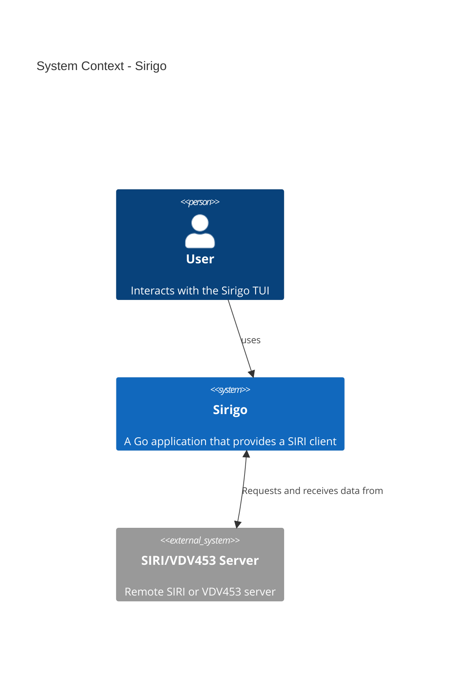
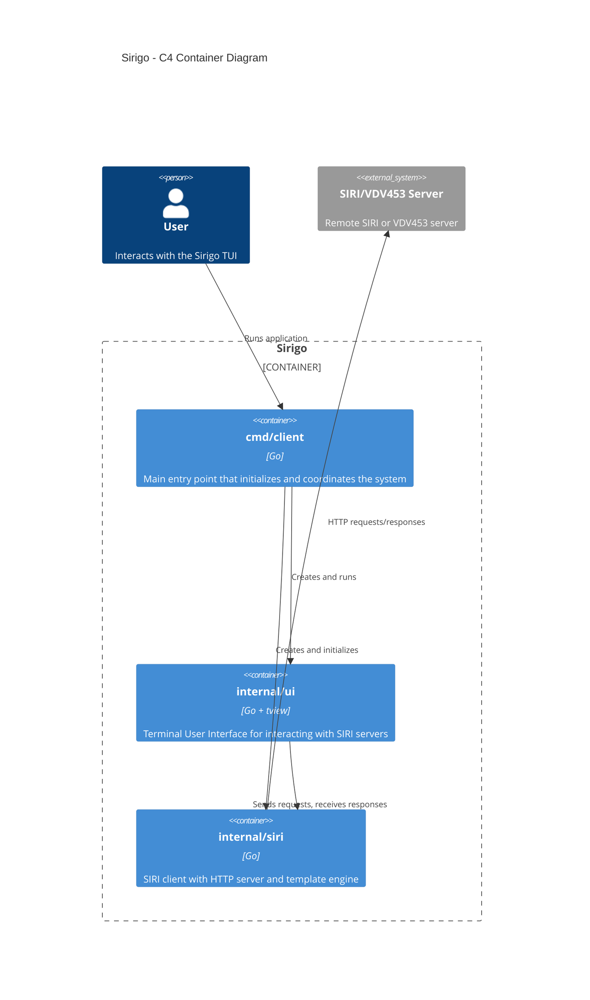

# Introduction

The architecture documentation follows a pragmatic approach. Normally, an [Arc42 documentation](https://arc42.org/) would be the way to go, but for this personal project, it is sufficient to focus on [C4 diagrams](https://c4model.com/) and [ADRs](https://adr.github.io/).

# Context

# Container

# ADRs

## 20251114-1 Using Go

accepted

### Context

The author wants to improve their Go skills. Go is a commonly used language for command-line tools and Kubernetes-related tooling.

### Decision

This project will be implemented in Go.

### Consequences

- The codebase and development workflow will follow Go conventions (modules, build tooling, dependency management).
- There is a learning curve, which may result in some suboptimal or non-idiomatic code early on.
- Choosing Go influences CI, packaging, and contributor expectations.

## 20251114-2 Using `testify` for assertions

accepted

### Context

The project requires tests with clear assertions. The author is more familiar with assertion-style testing from other languages and prefers concise assertion helpers for readability.

### Decision

Use the `github.com/stretchr/testify/assert` assertion helpers to make tests more expressive and easier to read.

### Consequences

- Adds a testing dependency
- Tests may be easier to read and write, especially for those coming from other ecosystems
- This may reduce emphasis on the minimal standard-library testing style

## 20251114-3 Creating a TUI

accepted

### Context

The SIRI protocol introduces bidirectional communication: the client may need to accept inbound requests or push notifications, not just send requests. For testing against real SIRI servers and for quick interactive debugging, an interactive UI is useful. The primary goal remains to learn Go rather than building a full-featured desktop or web application.

### Decision

Implement a Terminal User Interface (TUI) rather than a desktop or web GUI.

### Consequences

- A TUI enables quick interactive testing and is lighter-weight to build and run
- It limits visual richness compared to desktop/web UIs and requires UI design that works well in text terminals
- Some UX compromises are expected for devices with only text and color support

## 20251115-1 Using `tview` as the TUI framework

accepted

### Context

A lightweight, actively maintained TUI library will speed up development and reduce boilerplate for common UI components (forms, tables, layout). The project requires a library that integrates well with Go and supports common terminal capabilities.

There are two major frameworks:
* `github.com/rivo/tview`
* `github.com/charmbracelet/bubbletea`

### Decision

Use `github.com/rivo/tview` as the primary TUI framework. `Bubbletea` looks nicer and more modern, but it follows a more complex architecture (the Elm Architecture) which would affect the whole application. Since the author is not confident with that architecture and the primary goal is learning Go, `tview` is preferred.

### Consequences

- The choice constrains UI patterns to what `tview` supports but reduces implementation effort

## 20251116-1 Focusing on ADRs and C4 for architecture documentation

accepted

### Context

Comprehensive architecture documentation formats (for example Arc42) are valuable but can be time-consuming for a small, personal project. A lighter-weight approach focusing on C4 diagrams for structural views and ADRs for decisions provides a good balance of clarity and effort.

### Decision

Focus documentation efforts on C4 diagrams and ADRs rather than producing a full Arc42 document

### Consequences

- Documentation remains concise and focused on decisions and high-level system structure
- Some detailed sections from a full Arc42 document may be omitted, but the most important architectural decisions and context will be captured
- This approach should be easier to maintain for a small project