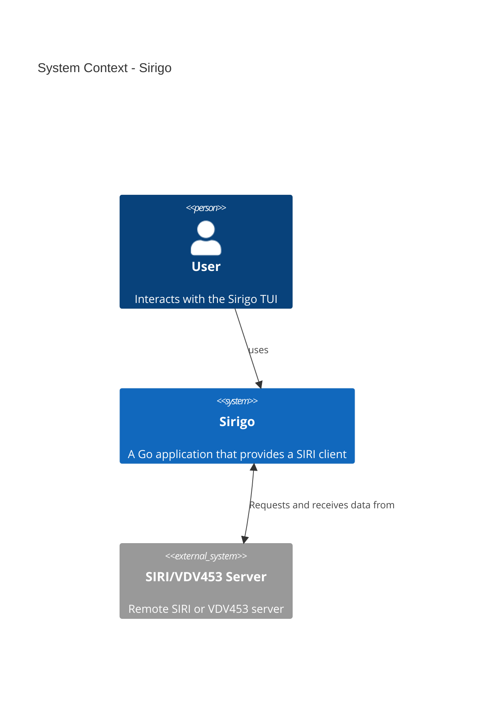
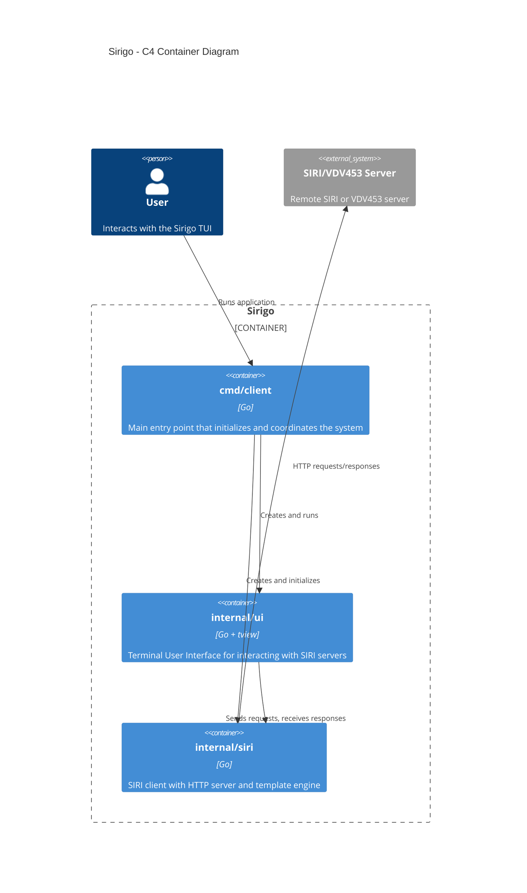

# Context

```mermaid
C4Context
    title System Context - Sirigo
    Person(user, "User", "Interacts with the Sirigo TUI")
    System(sirigo, "Sirigo", "A Go application that provides a SIRI client")
    System_Ext(siriServer, "SIRI/VDV453 Server", "Remote SIRI or VDV453 server")
    
    Rel(user, sirigo, "uses")
    BiRel(sirigo, siriServer, "Requests and receives data from")

    UpdateLayoutConfig($c4ShapeInRow="1", $c4BoundaryInRow="1")
```

# Container

```mermaid
C4Container
    title Sirigo - C4 Container Diagram
    
    Person(user, "User", "Interacts with the Sirigo TUI")
    
    System_Ext(siriServer, "SIRI/VDV453 Server", "Remote SIRI or VDV453 server")
    
    Container_Boundary(sirigo, "Sirigo") {
        Container(cmdClient, "cmd/client", "Go", "Main entry point that initializes and coordinates the system")

        Component(empty,"helper because Mermaid does not have real styling yet")   
         
        Container(uiPkg, "internal/ui", "Go + tview", "Terminal User Interface for interacting with SIRI servers")


        Container(siriPkg, "internal/siri", "Go", "SIRI client with HTTP server and template engine")
    }
        
    Rel(user, cmdClient, "Runs application")
    Rel(cmdClient, uiPkg, "Creates and runs")
    Rel(cmdClient, siriPkg, "Creates and initializes")
    Rel(uiPkg, siriPkg, "Sends requests, receives responses")
    Rel(siriPkg, siriServer, "HTTP requests/responses")

    UpdateElementStyle(empty, $fontColor="rgba(0,0,0,0)", $bgColor="rgba(0,0,0,0)", $borderColor="rgba(0,0,0,0)")
    UpdateRelStyle(uiPkg, siriPkg, $offsetY="40", $offsetX="-60")
    UpdateLayoutConfig($c4ShapeInRow="2", $c4BoundaryInRow="1")
```